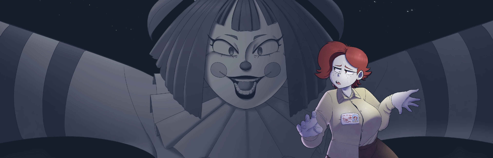
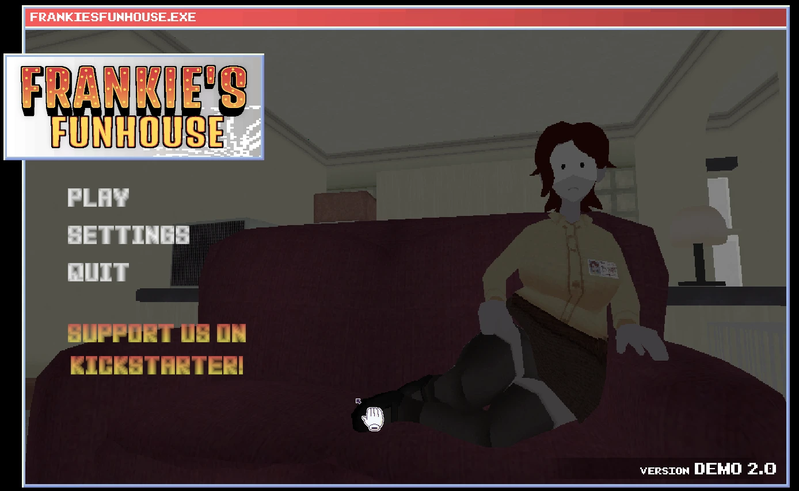
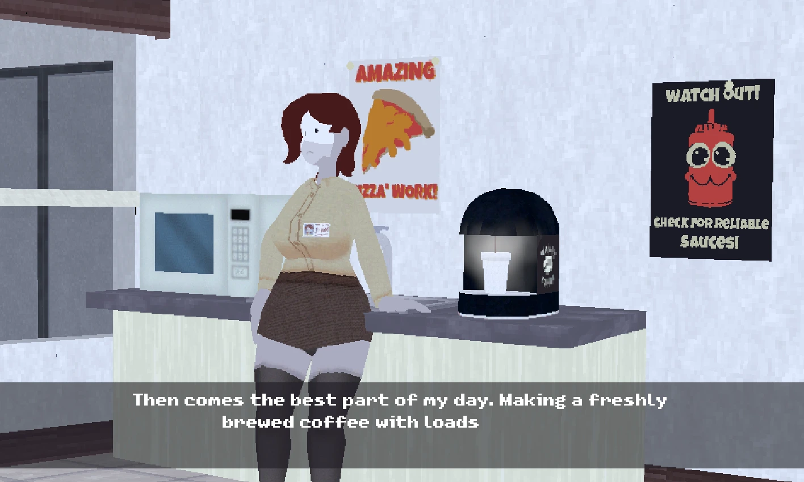
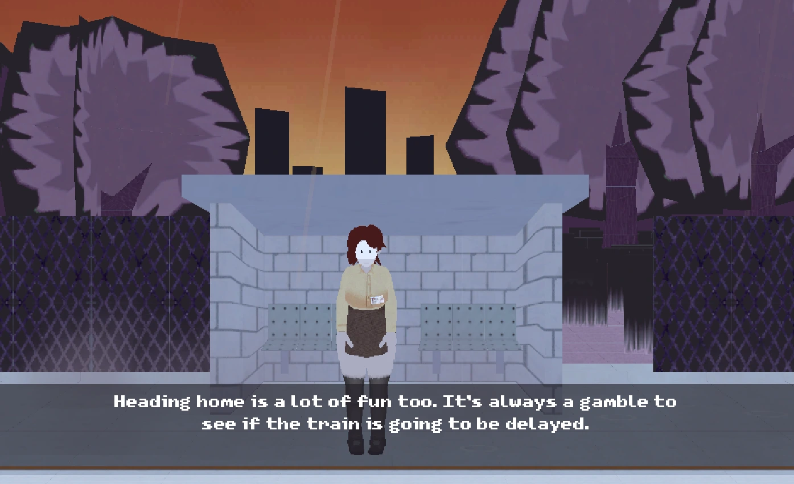
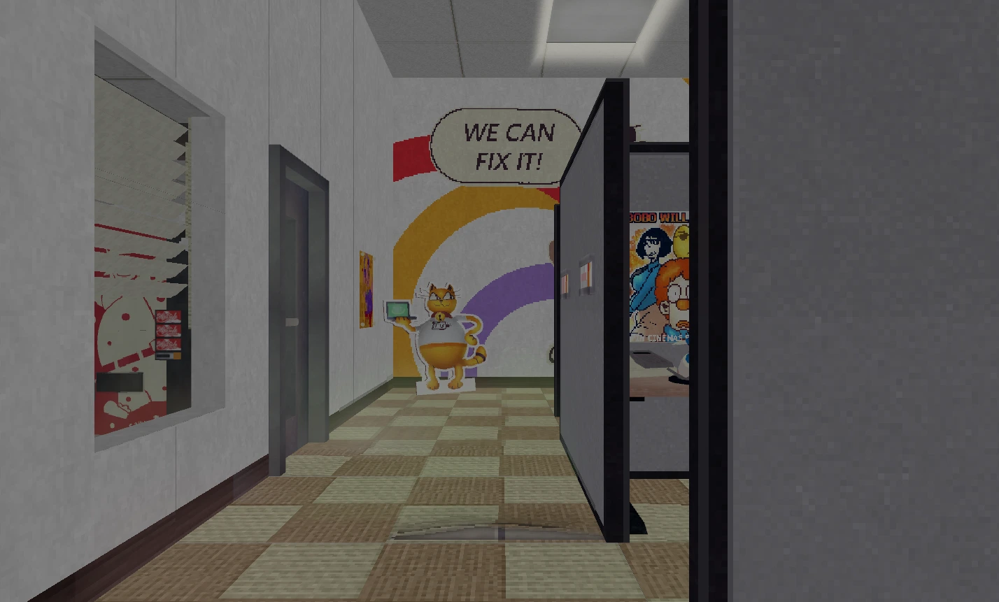
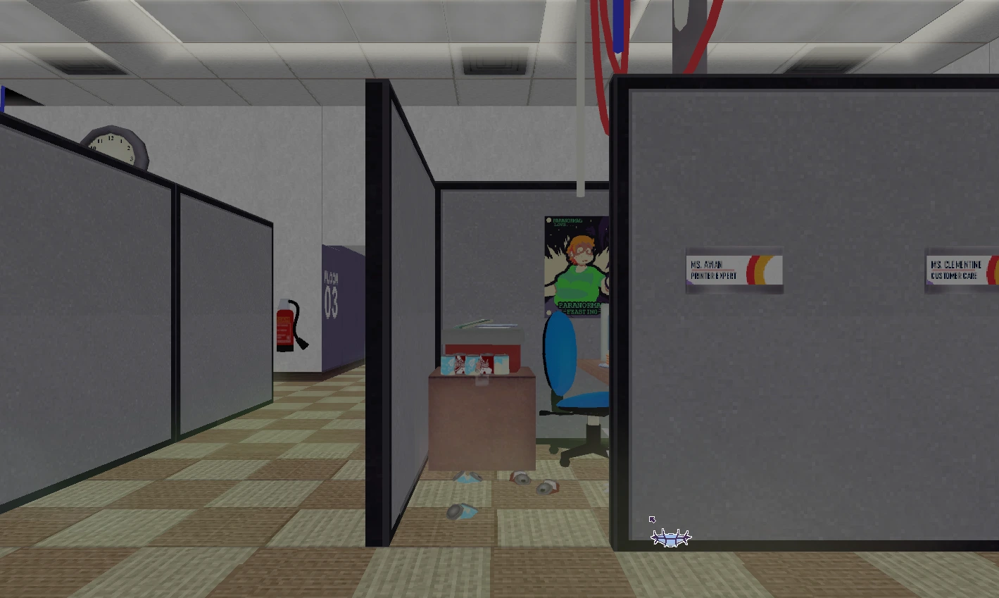

# Frankie's Fun House — Free Online Game Guide and Browser Portal

Welcome to the public static website repository for **[Frankie's Fun House](https://frankiesfunhouse.org/)**, an independent, fan-made browser portal and illustrated guide built around the peculiar point-and-click puzzle adventure. The website introduces the game, gives visitors a convenient free online play area, explains the basic experience without spoiling its surprises, and presents a collection of screenshots in a responsive layout inspired by the strange contrast at the heart of the game: an ordinary office day that gradually opens into a colorful world of tricks, clues, unusual characters, and unexpected discoveries.

The live website is available at **[https://frankiesfunhouse.org/](https://frankiesfunhouse.org/)**. Visitors can arrive at the home page and immediately see the main game frame, the title, and a concise description. The experience is intentionally direct. There is no account requirement, no paywall on the portal, and no long sequence of pages to navigate before reaching the game area. A clear play interaction loads the hosted game inside the page, while share and fullscreen controls make it easy to continue in the format that suits the player.

This repository contains only the generated static export in the `out` directory, not the original application source code. That makes it suitable for direct deployment to a static web host, CDN, object-storage service, or any platform capable of serving HTML, CSS, JavaScript, images, XML, and text assets. The exported site includes the home page, legal and trust pages, discovery content, media assets, and an additional game page. Everything required to serve the current website build is kept together in this repository.

## Live Website

The canonical public address is:

### [https://frankiesfunhouse.org/](https://frankiesfunhouse.org/)

The browser game loaded by the main play frame is hosted separately at:

`https://s.frankiesfunhouse.org/games/frankies-fun-house/index.html`

Separating the game build from the surrounding editorial website keeps the main portal lightweight and allows the game frame to load only when the visitor chooses to play. The website provides the presentation layer, navigation, introduction, controls, related-game discovery, and policy information. The dedicated game host provides the interactive game files displayed inside the iframe.

## About the Game Experience

**Frankie's Fun House** is presented as a peculiar point-and-click puzzle adventure in which a familiar workday becomes a ticket to someplace far less ordinary. The visual identity combines muted office colors, hand-drawn character reactions, deep fun-house blue, warm carnival red, and playful decorative details. The result feels inviting at first glance but retains an offbeat, mysterious edge that fits a game built around observation and surprise.

The site avoids turning the introduction into a walkthrough. Instead, it gives new visitors enough context to understand the premise and begin playing with confidence. Players are encouraged to inspect the environment, notice small changes, interact with interesting objects, read visual clues, and try ideas that may initially seem unimportant. Point-and-click adventures often reward curiosity more than speed, so the page emphasizes exploration and patient observation instead of competitive scoring or complicated controls.

The main interaction is simple: use the pointer to explore the scene and select objects or areas that appear meaningful. The exact responses are part of the fun, and the website deliberately keeps its advice broad. If progress slows, looking again at the room, revisiting an earlier object, or considering the relationship between two clues can be more useful than clicking randomly. The game is best approached as a sequence of small discoveries rather than a race toward an ending.

## Website Highlights

The home page has been designed to put the playable experience first while still offering useful information below the fold. Its major features include:

- **Immediate game visibility.** The main play frame appears near the top of the page so a visitor understands the purpose of the site as soon as it opens.
- **Deferred iframe loading.** The remote game is loaded after the user chooses to play, reducing unnecessary work during the initial page visit.
- **Fullscreen support.** A dedicated control lets compatible browsers expand the game area for a more focused experience.
- **Built-in sharing.** The share action helps visitors send the canonical page to friends or copy the link when native sharing is unavailable.
- **Responsive screenshot gallery.** Desktop layouts display two images per row while preserving each image's complete natural aspect ratio. Smaller screens move to a comfortable single-column presentation.
- **Related-game discovery.** A game-card section below the primary frame gives the portal room to grow and lets visitors continue exploring other unusual browser games.
- **Persistent navigation.** The top bar remains accessible while scrolling and includes an animated “Play More” action that jumps directly to the game-card area.
- **Accessible trust pages.** About, Privacy Policy, Contact, and Terms of Service links appear in the shared navigation and provide clear information about the website.
- **Search-engine support.** The export includes metadata, canonical references, `robots.txt`, and `sitemap.xml` for discoverability and consistent indexing.
- **Static hosting compatibility.** The generated output does not require a Node.js server for ordinary production delivery.

## Visual Gallery

The website uses actual game imagery to communicate atmosphere more effectively than a long plot summary could. The gallery preserves the full content of each screenshot rather than cropping it into a fixed portrait frame. On a wide display, two screenshots sit side by side; on a phone, each image receives the full available width.

The contrast between locations is an important part of the presentation. Some scenes feel like an intentionally plain office, while others use bolder silhouettes, theatrical framing, or brighter colors. The site background follows the same design logic. Cream paper tones create a readable editorial surface, navy typography gives the page structure, and red and blue accents recall a playful carnival sign without making the interface difficult to use.

All gallery files are stored locally in this static export. This avoids reliance on third-party image hotlinking and ensures that the repository documents the exact media set used by the deployed version. WebP is used to balance visual quality and download size across modern browsers.

## How to Play on the Website

1. Open **[frankiesfunhouse.org](https://frankiesfunhouse.org/)** in a current desktop or mobile browser.
2. Find the large game panel at the beginning of the home page.
3. Select the play control to load the game from the dedicated game host.
4. Use the pointer to inspect the scene and interact with available objects.
5. Use the fullscreen button below the frame if you want a larger, distraction-free view.
6. Use the share button to send the page to another player.
7. Scroll to the gallery and guide sections for spoiler-light context, or continue to the game-card area to discover another title.

For the smoothest experience, allow JavaScript and make sure the browser permits content from `s.frankiesfunhouse.org`. If an extension blocks cross-site frames, scripts, or storage, temporarily allowing the trusted game subdomain may be necessary. A stable network connection is also recommended because the game package is loaded separately from the static website shell.

Keyboard commands and exact interaction behavior may depend on the embedded game build. The website itself keeps navigation conventional: links can be focused by keyboard, page sections follow a logical reading order, and buttons use visible labels. Fullscreen behavior is governed by the browser's Fullscreen API and may vary slightly on mobile operating systems.

## Site Structure

The export includes several public routes, each represented by static HTML and supporting Next.js assets:

- `/` — the main Frankie's Fun House portal, game frame, introduction, screenshots, interaction tracker, and related games.
- `/uncanny-cat-golf/` — an additional game detail page available through shared discovery areas.
- `/about/` — information about the fan-made website, its purpose, and its editorial approach.
- `/privacy/` — an explanation of privacy considerations and how the site handles visitor interactions.
- `/contact/` — the website contact route for questions, corrections, or rights-related requests.
- `/terms/` — the terms governing use of the portal and its informational content.
- `/404/` — the static not-found page used when a visitor requests a missing route.
- `/sitemap.xml` — the machine-readable list of canonical public pages.
- `/robots.txt` — crawler guidance for search engines and other automated clients.

The `_next` directory contains versioned JavaScript and CSS produced during the static build. Text files adjacent to route output are framework-generated payloads used for navigation and rendering. These files should be deployed together with the HTML and media assets. Removing apparently unfamiliar generated files can break client-side transitions or page styling, so a host should publish the complete repository contents.

## Interaction and Discovery Design

Beyond the playable frame, the site includes a lightweight discovery tracker. This interface gives visitors a set of optional moments or observations to mark as they explore. Progress is stored privately in the current browser rather than tied to a user account. The tracker is designed to increase interaction without forcing registration, exposing personal profiles, or turning a quiet puzzle experience into a competitive checklist.

The “Play More” area serves a related but broader purpose. The main game remains the focus, yet the card grid creates a natural destination after a visitor finishes reading or playing. The animated header action points to that section and makes the feature discoverable even on a long page. As the portal expands, additional cards can be introduced without changing the basic navigation model.

This balance is deliberate. A game page should offer more than an iframe, but supporting content should not obscure the thing people came to play. The website therefore uses a clear hierarchy: play first, understand the premise, explore visual material, engage with optional tracking, and discover another game when ready.

## Privacy, Legal Information, and Contact

The portal includes substantive trust pages rather than hiding essential information in a single footer line. Visitors can open the Privacy Policy, About page, Contact page, and Terms of Service from the top navigation. The same destinations remain available in the shared footer and on the trust pages themselves, including on smaller screens through responsive navigation.

This project is an **unofficial, fan-made website**. It is not presented as the official website of the game's developer or publisher. Game names, artwork, screenshots, trademarks, and related intellectual property belong to their respective owners. They are used here to identify and discuss the game and to provide the intended portal experience. If you are a rights holder and believe material should be corrected, credited differently, or removed, please use the site's contact page or email **mooyuking@gmail.com**.

Visitors should review the live Privacy Policy and Terms of Service for the current wording that applies to use of the website. Repository documentation is an overview and does not replace those pages. Because the embedded game is delivered from a separate subdomain, technical requests made by the game frame may be distinct from requests used to load the surrounding static site.

## Deployment

This repository is a ready-to-serve static export. A deployment should use the repository root as the publish directory and preserve the existing folder structure. No `npm install`, application build, or server-side runtime is required to serve the exported result. A typical static host only needs to copy the files and return each directory's `index.html` for clean URLs.

Recommended production behavior includes:

- Serve the canonical domain over HTTPS.
- Redirect `www` and alternate hostnames to `https://frankiesfunhouse.org/` if they are configured.
- Preserve trailing-slash directory routing so `/about/` resolves to `/about/index.html`.
- Send correct MIME types for `.html`, `.css`, `.js`, `.webp`, `.xml`, and `.txt` files.
- Apply long-lived caching to fingerprinted files inside `_next/static` while allowing HTML documents to refresh promptly.
- Keep iframe permissions compatible with fullscreen and the embedded game's required browser features.
- Deploy `robots.txt` and `sitemap.xml` at the domain root.
- Use a custom 404 mapping that points to the exported not-found page when the hosting provider supports it.

When a new production build is generated, its changed and newly fingerprinted files should replace the previous export as a single release. Old hashed assets can be removed only after confirming that the newly generated HTML no longer references them. Publishing the full export together avoids a temporary mismatch between new pages and older JavaScript or CSS bundles.

## Repository Purpose

Keeping the production export in its own repository provides a clean separation between source development and public deployment. Hosting services receive only the files they need to serve. Private notes, local caches, development dependencies, recovery directories, and unrelated projects are not included. This also makes each release easy to inspect: changes in HTML, static assets, route payloads, images, and search-engine files are visible in the repository history.

The repository is not intended to teach the complete internal implementation of the website, because the editable application source is maintained separately. Instead, it is the deployable artifact for the live domain. Issues discovered in production should normally be corrected in the source project, rebuilt, validated, and then exported here. Editing generated JavaScript or framework payload files by hand is discouraged because those changes will be overwritten by the next build.

## Browser Compatibility

The site targets current versions of Chrome, Edge, Firefox, and Safari. It uses responsive CSS, modern image formats, client-side interaction, the Web Share API when available, and the Fullscreen API. Where native sharing is unavailable, the interface can fall back to copying or presenting the page link. Older browsers that do not support every enhancement should still receive the core static content, navigation, and images, although the embedded game itself may have additional compatibility requirements.

Mobile presentation is treated as a real layout rather than a compressed desktop page. Navigation remains reachable, text columns become narrower, controls retain touch-friendly dimensions, game cards stack appropriately, and the screenshot gallery changes from two columns to one. Images retain their full proportions so captions, characters, and interface details are not lost through aggressive cropping.

## Credits and Acknowledgements

The original game concept, artwork, characters, screenshots, and playable experience are credited to their respective creators. The public game reference and developer presentation can be found on the creator's itch.io page: **[Frankie's Fun House Ch. 1 Demo by Studio Big Bun](https://studiobigbun.itch.io/frankies-fun-house-ch1-demo)**.

This website project focuses on organizing an accessible browser entry point, a spoiler-light introduction, responsive media presentation, related-game discovery, and transparent trust information. It exists for players who want a simple place to learn what kind of adventure awaits and start playing online.

Thank you for visiting, exploring, and sharing the project. Begin at **[https://frankiesfunhouse.org/](https://frankiesfunhouse.org/)**, take your time with the clues, and remember that in a fun house, the most ordinary-looking detail may be the one worth examining twice.

